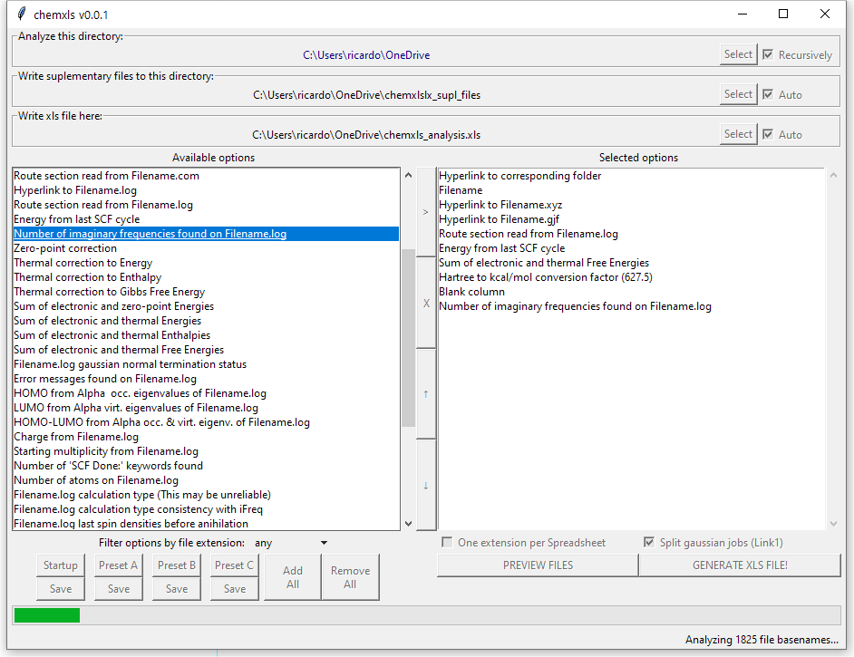
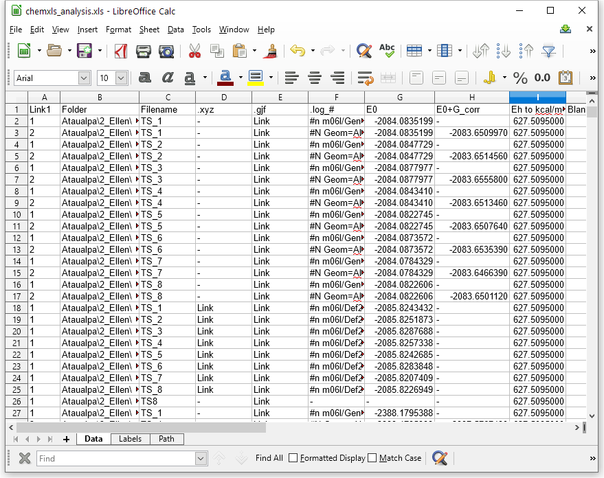

# chemxls

**Chemxls** can recursively analyze directories and mine data from some of the most common computational chemistry input and output files. This data is then organized, on an easily configurable way, into an user friendly Spreadsheet document that containing raw data, processed data or Hyperlinks to aditional data.

## User Interface



## Installing & Running

The recommended installaion requires python 3.8 or above.

Fresh instalation can be done via:
```bash
python3 -m pip install setuptools chemxls
```
Upgrading from older versions can be done via:
```bash
python3 -m pip install -U chemxls
```
The program can be run via:
```bash
python3 -m chemxls
```
If you want to analyze the current directory, you can start the program and set the directory simultaneously with:
```bash
python3 -m chemxls --cwd
```
 
Alternatively, a Windons 10 executable can be downloaded on the following link:\
[**chemxls-v001.exe**](https://github.com/ricalmang/chemxls/releases/download/v0.0.1/chemxls-v001.exe)

## Output

The output will be a spreadsheet document containing the requested data:



## Contact

If you would like to see more features covered by **chemxls** or have any other question, please contact-me at:\
ricardo_almir@hotmail.com